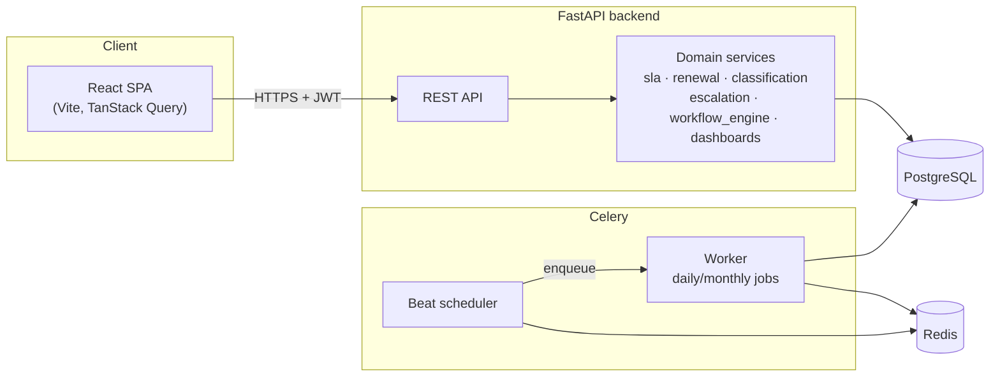
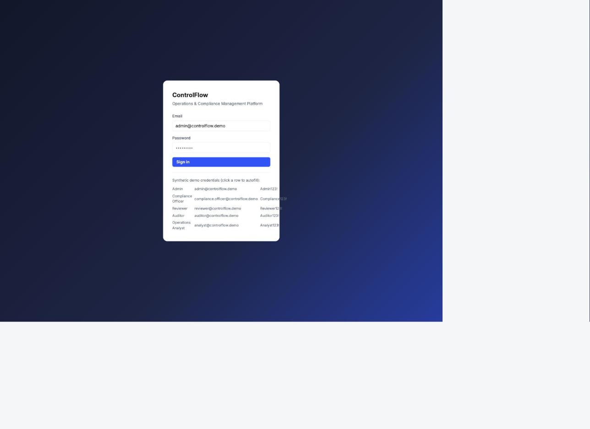
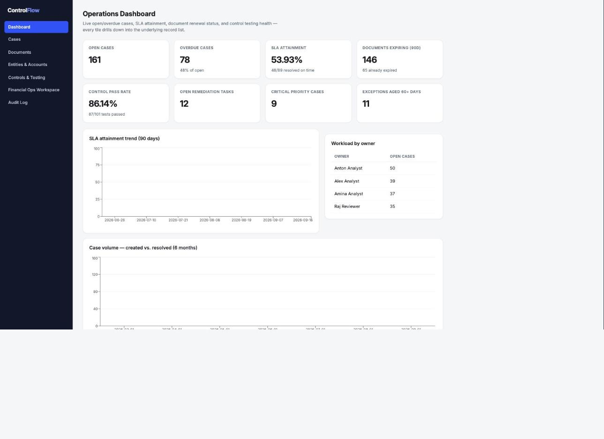
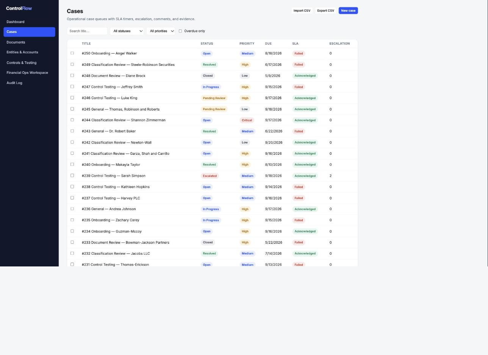
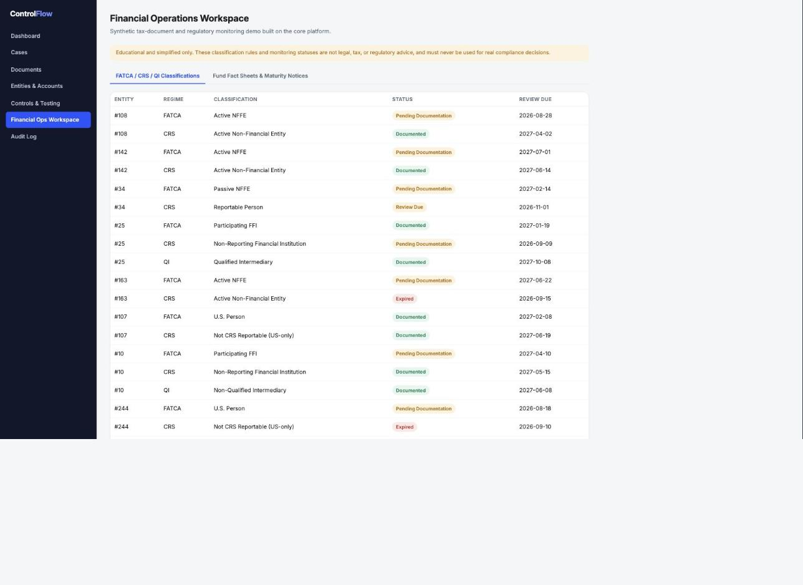

# ControlFlow

**Operations and Compliance Management Platform** — a configurable platform
for regulated operations teams to manage records, documents, cases, service
deadlines, approvals, control testing, escalations, and audit evidence.

The core product is industry-neutral. This repository ships one concrete
demo on top of it: a **financial-operations workspace** modeling
tax-document (W-8/W-9) tracking and simplified FATCA/CRS/QI regulatory
monitoring, built on synthetic data only.

> Educational demo only — not legal, tax, or regulatory advice, and not
> production software. See [`docs/security-and-limitations.md`](docs/security-and-limitations.md).

## Why this exists

Regulated operations teams spend a lot of their time on work that has the
same shape regardless of industry: a record needs a decision, a decision
needs evidence, evidence needs a deadline, deadlines get missed, missed
deadlines need escalation, and someone eventually has to prove all of that
happened correctly to an auditor. ControlFlow builds that shape once — a
configurable workflow engine with an immutable event history, optimistic
locking, idempotent scheduled jobs, and an audit trail that's structurally
append-only — and demonstrates it with a realistic financial-ops case study.

## Architecture



Full write-up, request-flow walkthrough, and directory layout:
[`docs/architecture.md`](docs/architecture.md).

**Stack**: Python 3.12 / FastAPI · SQLAlchemy 2.0 / Alembic · PostgreSQL 16 ·
Celery + Redis · React 19 / TypeScript / Vite · Pytest + Playwright · GitHub
Actions · Docker Compose.

## Screenshots

| Login | Dashboard |
|---|---|
|  |  |

| Cases | Financial-ops workspace |
|---|---|
|  |  |

## Setup

```bash
git clone <this-repo>
cd ControlFlow
cp .env.example .env
make demo        # docker compose up (db, redis) → migrate → seed → up (api, worker, beat, frontend)
```

- Frontend: **http://localhost:5173**
- API + interactive docs: **http://localhost:8000/docs**

Or step by step:

```bash
docker compose up --build   # everything, foreground
make seed                   # deterministic synthetic demo data (safe to re-run)
make seed-reset             # wipe + regenerate from scratch
```

If Docker isn't available in your environment, the whole stack runs equally
well against local Postgres/Redis — see the "Running without Docker" section
of [`docs/runbook.md`](docs/runbook.md) (this is in fact how it was verified
during development, after hitting an unrelated local Docker Desktop
image-store issue).

## Demo credentials

| Role | Email | Password |
|---|---|---|
| Admin | admin@controlflow.demo | Admin123! |
| Compliance Officer | compliance.officer@controlflow.demo | Compliance123! |
| Reviewer | reviewer@controlflow.demo | Reviewer123! |
| Auditor | auditor@controlflow.demo | Auditor123! |
| Operations Analyst | analyst@controlflow.demo | Analyst123! |

Full scenario walkthroughs (document approval, case resolution, overdue
escalation, control testing, audit export, daily/monthly monitoring, the
FATCA/CRS/QI workspace) with specific record IDs: [`docs/demo-guide.md`](docs/demo-guide.md).

## Core workflows

- **Records & cases** — configurable record types, case queues with
  priority-scaled SLA timers, comments, attachment metadata, bulk update,
  CSV import/export, saved views.
- **Document controls** — completeness scoring, deterministic
  duplicate detection, renewal reminders (7/30/60/90-day buckets), and a
  role-gated draft → pending_review → approved/rejected approval workflow.
- **Workflow engine** — data-driven states/transitions/roles/required
  fields, with an append-only event history that's always the single source
  of truth for "what state is this in" (see [`docs/workflow-design.md`](docs/workflow-design.md)).
- **Controls & audits** — sample-based control testing, sign-off,
  remediation tasks, exception aging, and a CSV audit-evidence export.
- **Dashboards** — every tile is a real SQL aggregation
  (`backend/app/services/dashboards.py`) that drills down into the exact
  list-view filter reproducing its number.
- **Financial-ops demo workspace** — synthetic dealers/clients/accounts,
  simplified W-8/W-9 and FATCA/CRS/QI modeling, fund-fact-sheet and
  maturity-notice distribution tracking. Clearly labeled educational.
- **Idempotent background jobs** — daily/monthly Celery jobs guarded by a
  `(job_name, run_key)` unique constraint, so retries and duplicate
  deliveries are safe no-ops.

## Tests

```bash
make test    # backend pytest (80%+ coverage gate) + frontend build
make lint    # black / ruff / mypy + frontend lint
make e2e     # Playwright, against a stack started with `make up`
```

**Verified in this environment:** 134 backend tests passing (44 unit + 90
integration), **93.1% coverage** on backend domain logic (`app/`, floor
enforced at 80% in CI), 10/10 Playwright end-to-end tests passing covering
case resolution, document approval, overdue escalation, control testing,
dashboard filtering, and audit-package export. Backend is black/ruff/mypy
clean; frontend builds and type-checks cleanly (`tsc -b && vite build`) and
passes lint. Full breakdown, coverage numbers, and — notably — **seven real
bugs this test process found and fixed** (not hypothetical): [`docs/test-plan.md`](docs/test-plan.md).

## Design decisions

- **Derived workflow state, not a stored column.** Current state is always
  computed from the latest `WorkflowEvent`, never duplicated onto the entity.
  This makes "history disagrees with current state" structurally impossible
  for anything that goes through the engine — see `docs/workflow-design.md`
  for a real bug this design didn't (and, once found, was fixed to) prevent.
- **Enum columns store `.value`, not `.name`.** SQLAlchemy's default `Enum`
  type persists a Python enum's *member name*; a shared `str_enum()` helper
  (`app/models/enums.py`) overrides that so the database, the JSON API, and
  the frontend all agree on lowercase values like `"in_progress"`.
- **Dashboard tiles and their drilldowns share one source of truth.**
  `OPEN_STATUSES` lives in one place (`services/sla.py`) and is used by both
  the dashboard aggregation and the list-endpoint filter it links to,
  specifically because they drifted apart once during development and a
  test now guards against it happening again.
- **CSV downloads are authenticated blob fetches, not `<a href>` links.**
  A JWT bearer token never rides along with a plain browser navigation; the
  export buttons fetch the file via the authenticated API client and trigger
  the save through a throwaway object URL.
- **Real Postgres in tests, no mocks.** The schema leans on
  Postgres-specific types (JSONB, ARRAY) and optimistic-locking semantics
  that a mock or SQLite substitute would paper over.

## Limitations

See [`docs/security-and-limitations.md`](docs/security-and-limitations.md)
for the full list. Highlights: the financial-workspace classification rules
are deliberately simplified and explicitly not legal/tax advice; document
and case attachments store metadata only (no binary file storage); no
multi-tenant isolation, SSO, or MFA; JWTs are stored in `localStorage` (a
demo-appropriate trade-off, not a production recommendation).

## Resume-safe claims

Statements below are backed by the commands and evidence in this repo — run
them yourself rather than taking them on faith:

- Built a configurable workflow engine with append-only event history and
  role/required-field-gated transitions, covering two independent workflows
  (document approval, case lifecycle) — `backend/app/services/workflow_engine.py`,
  9 passing integration tests.
- Implemented idempotent scheduled background jobs (Celery + a
  unique-constraint-backed job ledger) verified safe against duplicate
  triggers by an automated test that calls each job twice and asserts the
  second call is a no-op — `backend/tests/integration/test_monitoring_jobs.py`.
- Achieved 93% automated test coverage on backend domain logic (134 tests:
  44 unit, 90 integration) against a real PostgreSQL database, no mocks —
  `make test`.
- Wrote and ran a 10-test Playwright end-to-end suite that, in the process
  of writing it, found and drove the fix for seven real cross-layer
  consistency bugs (dashboard/drilldown mismatches, a broken CSV export
  auth path, a workflow-state/status-column desync) — documented with root
  cause and fix in `docs/test-plan.md`.
- Designed a relational schema and dashboard layer where every metric is a
  real SQL aggregation with a corresponding, test-verified list-view filter
  — `backend/app/services/dashboards.py`.

## License

[MIT](LICENSE)
