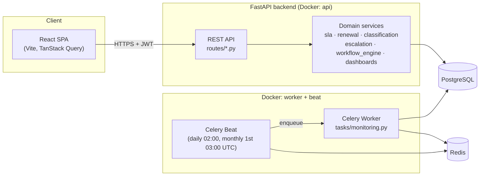

# Architecture

## Stack

| Layer | Technology |
|---|---|
| Backend API | Python 3.12, FastAPI, Pydantic v2 |
| ORM / migrations | SQLAlchemy 2.0, Alembic |
| Database | PostgreSQL 16 (JSONB, ARRAY columns used deliberately) |
| Background jobs | Celery + Redis (broker/result backend), Celery Beat scheduler |
| Frontend | React 19, TypeScript, Vite, TanStack Query, React Router, Recharts |
| Auth | JWT bearer tokens, bcrypt password hashing |
| Tests | Pytest (unit + integration), Playwright (e2e) |
| CI | GitHub Actions |
| Runtime | Docker Compose (Postgres, Redis, api, worker, beat, frontend) |

## System diagram



## Backend layout

```
backend/app/
  models/       SQLAlchemy ORM models (one module per domain area)
  schemas/      Pydantic request/response models
  api/routes/   FastAPI routers — one file per resource
  services/     Business logic, independent of HTTP (sla, renewal,
                classification, escalation, workflow_engine, dashboards,
                audit_log)
  tasks/        Celery app + the idempotent daily/monthly monitoring jobs
  seed/         Deterministic synthetic-data generator
  core/         Config, security (JWT/bcrypt), structured logging
  db/           Engine/session setup, declarative base
```

The route layer is intentionally thin: it validates input via Pydantic,
delegates to a service function or the workflow engine, writes an audit log
entry, and commits. Business rules (SLA math, completeness scoring,
classification logic, transition validation) live in `services/` so they're
unit-testable without spinning up HTTP or even a database in most cases
(`sla.py`, `renewal.py`, `classification.py` have zero DB dependency).

## The workflow engine

Two `WorkflowDefinition`s ship by default:

- **`document-approval`**: `draft → pending_review → approved | rejected`
  (rejected can resubmit back to `pending_review`).
- **`case-lifecycle`**: `open → in_progress → pending_review → resolved →
  closed`, with `escalate` reachable from any open-ish state and `reopen`
  from `escalated`/`resolved`.

State is never stored as a column — `current_state_key()` derives it by
reading the latest `WorkflowEvent` for that `(workflow, entity_type,
entity_id)`. This is a deliberate trade-off: it costs one indexed query per
lookup, but makes "current state disagrees with history" structurally
impossible. See `docs/workflow-design.md` for the full transition tables and
role/field requirements.

## Frontend layout

```
frontend/src/
  api/          axios client + typed endpoint wrappers (one function per
                backend route)
  auth/         AuthContext — JWT stored in localStorage, attached via an
                axios request interceptor
  components/   Layout (sidebar nav), StatusBadge, StatTile, ProtectedRoute
  pages/        One component per route; list pages own their filter state
                in the URL query string so links (including dashboard
                drill-downs) are shareable and back/forward-safe
```

Every dashboard tile's `to=` link and every backend list filter it points at
are covered by an integration test — the two are computed from the *same*
status-set constants (`app/services/sla.py::OPEN_STATUSES`) specifically so
they can't silently diverge again after this was caught and fixed during
Playwright testing (see `docs/test-plan.md`).

## Request flow example: approving a document

1. `POST /api/documents/{id}/approve` — role-gated to Reviewer/Compliance
   Officer/Admin via `require_roles`.
2. The route checks the optimistic-lock `version`, then calls
   `workflow_engine.apply_transition(..., transition_key="approve")`.
3. The engine looks up the current state from `WorkflowEvent` history, checks
   the transition exists from that state, checks the actor's role against
   `required_roles`, and inserts a new `WorkflowEvent`.
4. The route updates `Document.review_status` to match, sets `approver_id`,
   and writes an `AuditLog` row with before/after JSON.
5. One `db.commit()` — the workflow event, document update, and audit log
   land in the same transaction.

## Deployment topology (Docker Compose)

`db` and `redis` start first; `migrate` runs `alembic upgrade head` once and
exits; `api`, `worker`, `beat`, and `frontend` depend on `migrate` completing
successfully. See `docker-compose.yml` and `docs/runbook.md`.
