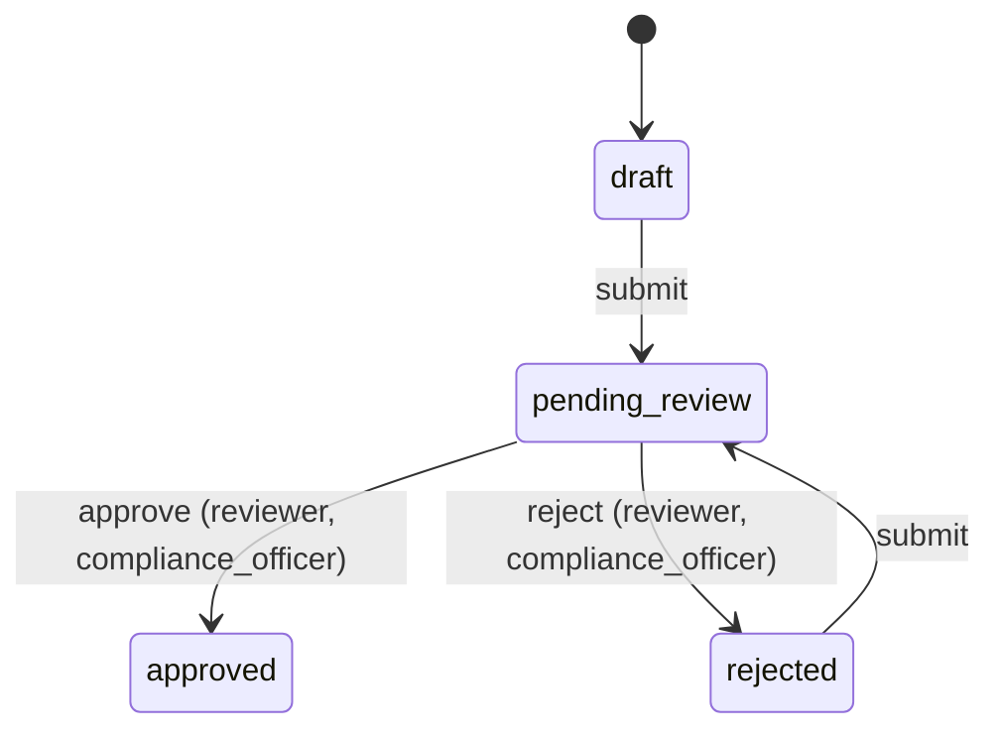
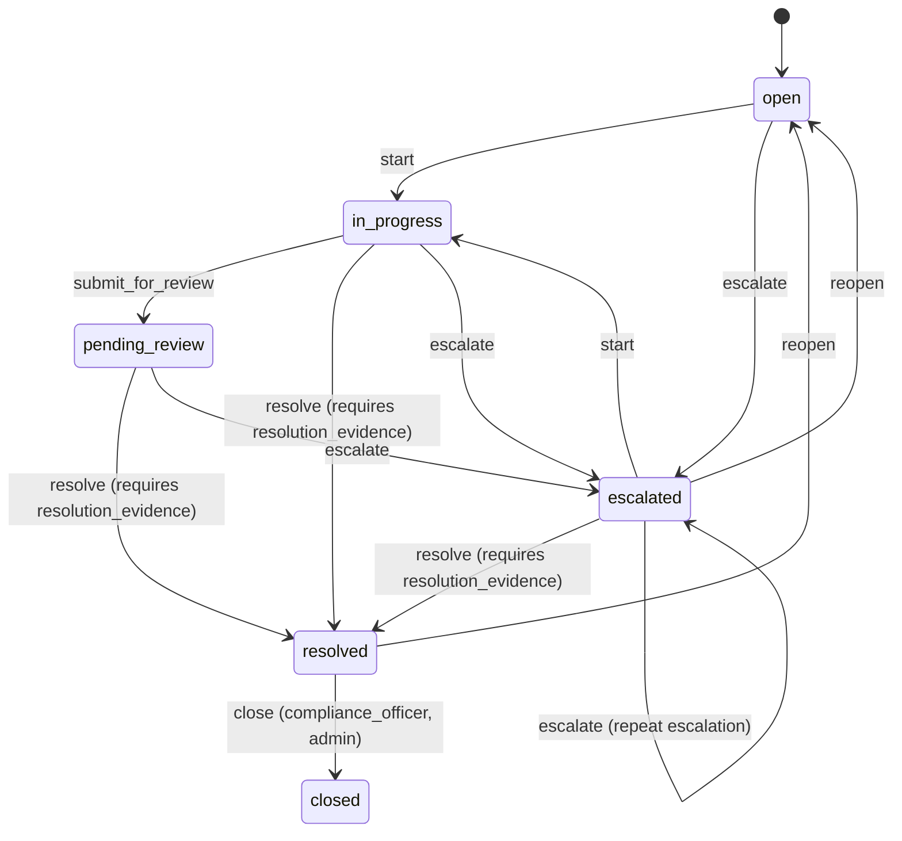

# Workflow Design

ControlFlow's workflow engine (`backend/app/services/workflow_engine.py`) is
generic: it operates on `WorkflowDefinition` / `WorkflowState` /
`WorkflowTransition` rows, not on hardcoded case/document logic. Two
workflows are seeded for the demo; more can be added by inserting rows,
without touching the engine.

## Core model

| Table | Purpose |
|---|---|
| `workflow_definitions` | One row per workflow (`key`, `entity_type`) |
| `workflow_states` | States for a workflow; exactly one has `is_initial=True` |
| `workflow_transitions` | Edges: `from_state → to_state`, keyed by `key`, optionally `required_roles` (JSON list) and `required_fields` (JSON list) |
| `workflow_events` | Immutable, append-only history: one row per state change, ever |

Current state is **derived**, not stored: `current_state_key()` reads the
most recent `WorkflowEvent` for `(workflow_id, entity_type, entity_id)`,
falling back to the workflow's initial state if no event exists yet. This
means:

- History and "current state" can never disagree — there is only one source
  of truth.
- A brand-new entity is placed in its initial state by `initiate()`, which
  writes a `from_state_key=NULL` event. This must be called at creation time;
  see the pitfall below.

### A pitfall this project actually hit

Early in development, the demo-data seed script set `Case.status` /
`Document.review_status` directly (e.g. to `resolved`) without also writing
the corresponding `WorkflowEvent`s. The **column** said `resolved`, but the
**engine** — having only ever seen the initial `create` event — still
reported `open`. The UI, which asks the engine for available actions, showed
"Start work / Escalate" on a case that was actually already resolved.

This is exactly the class of bug the derived-state design is supposed to
make impossible *for real transitions*, but it doesn't protect against code
that mutates the status column and skips the engine entirely. The fix
(`backend/app/seed/seed.py::_record_case_workflow_path` /
`_record_document_workflow_path`) makes the seed script write a realistic
event path (e.g. `open → in_progress → resolved`) for every non-initial
status, with timestamps that stay chronologically consistent with the
`create` event. The lesson generalizes: **any code path that sets a
workflow-backed status column must also drive the engine**, or add an
integration test that fetches `/api/workflows/{key}/{type}/{id}` and asserts
it agrees with the entity's own status field. Two tests do exactly that:
`backend/tests/integration/test_accounts_and_workflow_routes.py` and the
Playwright case-resolution/document-approval specs, which check the on-page
"Workflow state" row against the status badge.

## `document-approval` workflow

- `submit` requires no role (any authenticated user working the document) but
  the document route additionally requires `completeness_score == 100`
  before allowing it.
- `approve` / `reject` require the `reviewer` or `compliance_officer` role
  (Admin always bypasses role checks).
- `expired` is **not** a workflow state. The daily monitoring job sets
  `Document.review_status = EXPIRED` directly and writes an audit log entry,
  but does not touch the workflow event history — an expired document's
  workflow state remains whatever it last legitimately was (usually
  `approved`). This mirrors how expiry is a time-based side effect, not a
  human decision in the approval graph.

## `case-lifecycle` workflow

- `resolve` requires the `resolution_evidence` field to be present and
  non-empty — enforced by the engine (`MissingFieldsError` → HTTP 400) *and*
  by the Pydantic schema (`CaseResolve.resolution_evidence` has
  `min_length=1`), so the check happens twice: once cheaply at the API
  boundary, once authoritatively in the engine.
- `close` is the one transition gated to a specific role
  (`compliance_officer`/`admin`) — an analyst can resolve their own case but
  not close it out.
- Automatic escalation (the daily job, `services/escalation.py`) drives the
  same `escalate` transition as the manual "Escalate" button, using
  `actor_role=Role.ADMIN` and `actor_id=None` to represent a system action —
  it is not a separate code path, so its effect on state is identical to a
  human clicking escalate.

## Escalation rules

`EscalationRule` rows (`overdue_hours_threshold`, `applies_to`) are evaluated
by the daily job against every open case with a `due_at`. A case matching a
rule gets `escalation_level += 1`, priority bumped to at least `high`, an
auto-generated comment, a workflow `escalate` event, and an audit log entry
— all in the same job run. Two rules ship by default: 24-hour and 72-hour
thresholds (see `backend/app/seed/seed.py::seed_escalation_rules`).

## Required-field enforcement

`WorkflowTransition.required_fields` is a JSON list of field names. Callers
pass a `provided_fields` dict when applying a transition; the engine checks
every required field is present and truthy, or raises `MissingFieldsError`
before any state change is recorded. This keeps the enforcement declarative
(add a required field to the seed data, not to application code) and
symmetric between cases and documents.
